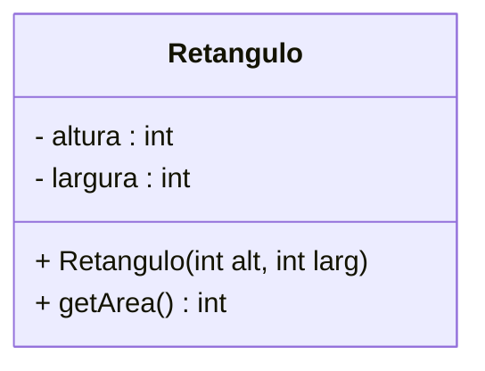
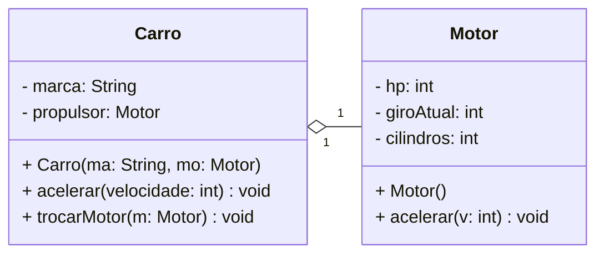

# Diagrama de classes UML

```mermaid
classDiagram
    
    class Retangulo{
        - altura : int
        - largura : int
        + Retangulo(int alt, int larg)
        + getArea() int
    }
```

```mermaid
classDiagram
    direction LR
    class Carro {
        - marca: String
        - propulsor: Motor
        + Carro(ma: String, mo: Motor)
        + acelerar(velocidade: int) void
        + trocarMotor(m: Motor) void
    }
    
    class Motor {
        - hp: int
        - giroAtual: int
        - cilindros: int
        + Motor()
        + acelerar(v: int) void
    }
    
    Carro "1" o-- "1" Motor

```