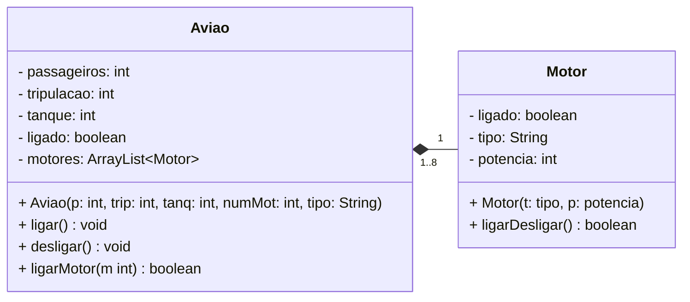

# Diagrama UML do projeto

```mermaid

classDiagram
    direction LR
    class Aviao{
        - passageiros: int
        - tripulacao: int
        - tanque: int
        - ligado: boolean
        - motores: ArrayList~Motor~
        
        + Aviao(p: int, trip: int, tanq: int, numMot: int, tipo: String)
        + ligar() void
        + desligar() void
        + ligarMotor(m int) boolean
    }
    
    class Motor {
        - ligado: boolean
        - tipo: String
        - potencia: int
        + Motor(t: tipo, p: potencia)
        + ligarDesligar() boolean
    }

    Aviao "1..8" *-- "1" Motor

```