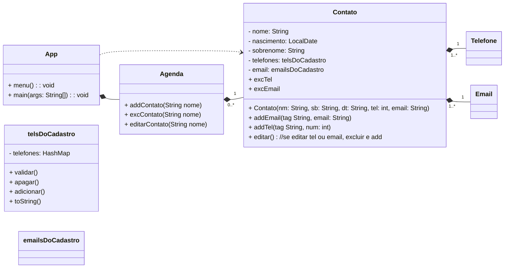

# Titulo
## titulo

```mermaid

classDiagram
    
    direction LR
    class App {
        
        + menu(): void
        + main(args: String[]): void
    }
    class Contato {
        - nome: String
        - nascimento: LocalDate
        - sobrenome: String
        - telefones: telsDoCadastro
        - email: emailsDoCadastro
        
        + Contato(nm: String, sb: String, dt: String, tel: int, email: String)
        + addEmail(tag String, email: String)
        + addTel(tag String, num: int)
        + editar() //se editar tel ou email, excluir e add
        + excTel
        + excEmail
    }
    
    class Agenda {
        
        + addContato(String nome)
        + excContato(String nome)
        + editarContato(String nome)
    } 
    
    class telsDoCadastro {
        - telefones: HashMap<String tagNum><String num>
        + validar()
        + apagar()
        + adicionar()
        + toString()
        
    }
    
    class emailsDoCadastro {
        
    }
    
    App ..> Contato
    App *-- Agenda
    Agenda "0..*" *-- "1" Contato
    Contato "1..*" *-- "1" Telefone
    Contato "1..*" *-- "1" Email
    

```