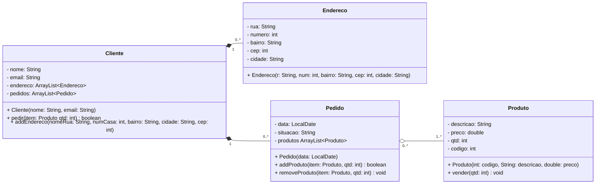

# Sistema de comércio eletrônico

## Modelagem de diagrama UML

```mermaid

classDiagram
    
    direction LR
    
    class Produto {
        - descricao: String
        - preco: double
        - qtd: int
        - codigo: int
        + Produto(int: codigo, String: descricao, double: preco)
        + vender(qtd: int) void
    }
    
    class Cliente {
        - nome: String
        - email: String
        - endereco: ArrayList~Endereco~
        - pedidos: ArrayList~Pedido~
        + Cliente(nome: String, email: String)
        + pedir(item: Produto qtd: int) boolean
        + addEndereco(nomeRua: String, numCasa: int, bairro: String, cidade: String, cep: int)
    }
    
    class Endereco {
        - rua: String
        - numero: int
        - bairro: String
        - cep: int
        - cidade: String
        + Endereco(r: String, num: int, bairro: String, cep: int, cidade: String)
    }
    
    class Pedido {
        - data: LocalDate
        - situacao: String
        - produtos ArrayList~Produto~
        + Pedido(data: LocalDate)
        + addProduto(item: Produto, qtd: int) boolean
        + removeProduto(item: Produto, qtd: int) void
    }
    
    Cliente "1" *-- "0..*" Pedido
    
    Pedido "0..*" o-- "1..*" Produto
    
    Cliente "1" *-- "0..*" Endereco 
    
    

```