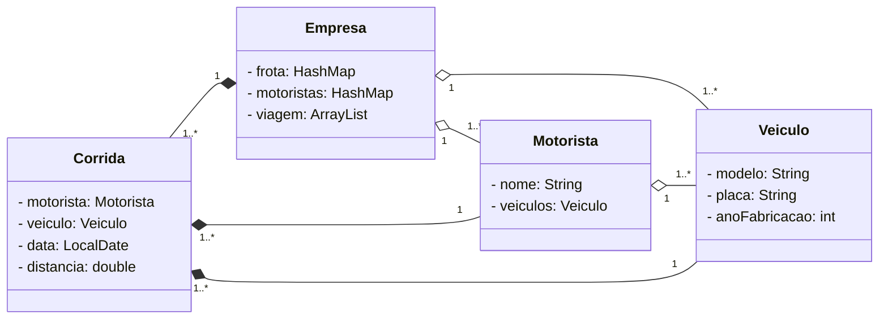

# Sistema de gestão de frota

## Diagrama de modelagem uml

```mermaid

classDiagram
    direction LR
    
    class Empresa {
        - frota: HashMap <int, Veiculo>
        - motoristas: HashMap <String, Motorista>
        - viagem: ArrayList<Corrida>
    }
    
    class Veiculo {
        - modelo: String
        - placa: String
        - anoFabricacao: int
    }
    
    class Motorista {
        - nome: String
        - veiculos: Veiculo
    }
    
    class Corrida {
        - motorista: Motorista
        - veiculo: Veiculo
        - data: LocalDate
        - distancia: double
    }  
    
    Empresa "1" o-- "1..*" Veiculo
    Empresa "1" o-- "1..*" Motorista
    Motorista "1" o-- "1..*" Veiculo
    Corrida "1..*" --* "1" Empresa
    Corrida "1..*" *-- "1" Veiculo
    Corrida "1..*" *-- "1" Motorista

```