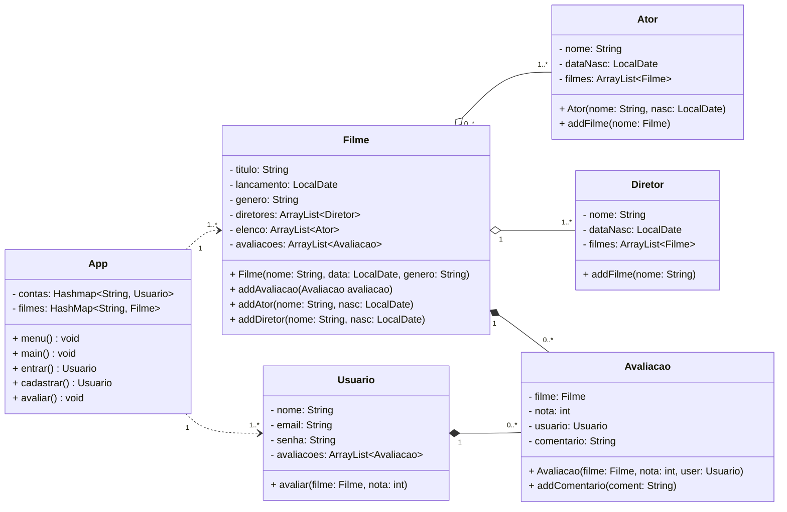

# Diagrama UML de modelagem de classes

# Sistema de avaliações de filmes (letterboxd)

```mermaid

classDiagram
    direction LR
    
    class Filme {
        - titulo: String 
        - lancamento: LocalDate
        - genero: String
        - diretores: ArrayList~Diretor~
        - elenco: ArrayList~Ator~
        - avaliacoes: ArrayList~Avaliacao~
        + Filme(nome: String, data: LocalDate, genero: String)
        + addAvaliacao(Avaliacao avaliacao)
        + addAtor(nome: String, nasc: LocalDate)
        + addDiretor(nome: String, nasc: LocalDate)
    }

    class Ator {
        - nome: String
        - dataNasc: LocalDate
        - filmes: ArrayList~Filme~
        + Ator(nome: String, nasc: LocalDate)
        + addFilme(nome: Filme)
    }
    
    class Usuario {
        - nome: String
        - email: String 
        - senha: String
        - avaliacoes: ArrayList~Avaliacao~
        + avaliar(filme: Filme, nota: int)
    }
    
    class Avaliacao {
        - filme: Filme
        - nota: int
        - usuario: Usuario
        - comentario: String
        + Avaliacao(filme: Filme, nota: int, user: Usuario)
        + addComentario(coment: String)
    }
    
    class Diretor {
        - nome: String
        - dataNasc: LocalDate
        - filmes: ArrayList~Filme~
        + addFilme(nome: String)
    }
    
    class App {
        - contas: Hashmap~String, Usuario~
        - filmes: HashMap~String, Filme~
        + menu() void
        + main() void
        + entrar() Usuario
        + cadastrar() Usuario
        + avaliar() void
    }
    
    App "1" ..> "1..*" Filme
    App "1" ..> "1..*" Usuario

    Usuario "1" *-- "0..*" Avaliacao
    Filme "0..*" o-- "1..*" Ator
    Filme "1" o-- "1..*" Diretor
    Filme "1" *-- "0..*" Avaliacao


```

